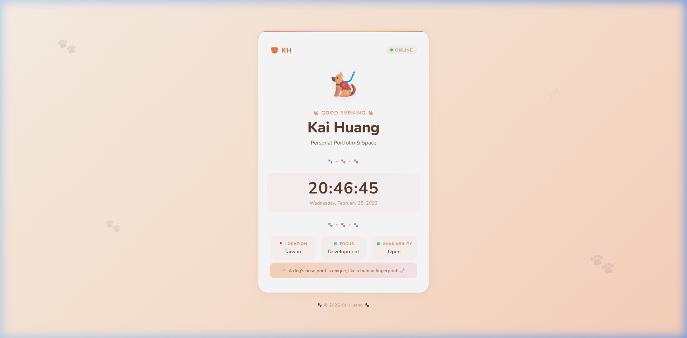

# Project Summary - February 25, 2026

## Overview
Today, we developed and deployed a modern, cute puppy-themed personal webpage for **Kai Huang**. The project involved creating a high-quality frontend and setting up a robust version control workflow with GitHub.

**Live Demo:** [https://kaiiicoding94.github.io/Lecture-DIC1-5114056031/](https://kaiiicoding94.github.io/Lecture-DIC1-5114056031/)

## Completed Tasks

### 1. Web Development
- **Main Interface (`index.html`)**: Built a cute, single-page layout featuring a dynamic greeting, current time display, animated puppy avatar, and rotating puppy fun facts.
- **Styling (`style.css`)**: Implemented a "Cute Puppy" design system using warm pastel colors, CSS variables, smooth gradients, paw-print decorations, and micro-animations for a playful look and feel.
- **Dynamic Features**: Added JavaScript to handle real-time clock updates, puppy emoji rotation, fun fact cycling, and responsive interactions.

### 2. Git & GitHub Integration
- **Local Initialization**: Initialized a new Git repository in the `LC1` directory.
- **Noreply Configuration**: Configured the project to use the GitHub-provided noreply email to ensure privacy without blocking deployments.
- **Successful Deployment**: Pushed the entire codebase to the remote repository: [https://github.com/kaiiicoding94/Lecture-DIC1-5114056031.git](https://github.com/kaiiicoding94/Lecture-DIC1-5114056031.git).

## File Structure
- `index.html`: Core structure and content.
- `style.css`: Visual design and animations.
- `README.md`: This project documentation.

## Future Recommendations
- Add more personal project showcases to the 'Projects' section.
- Integrate a contact form or social media links.
- Consider deploying the site via GitHub Pages for public access.
